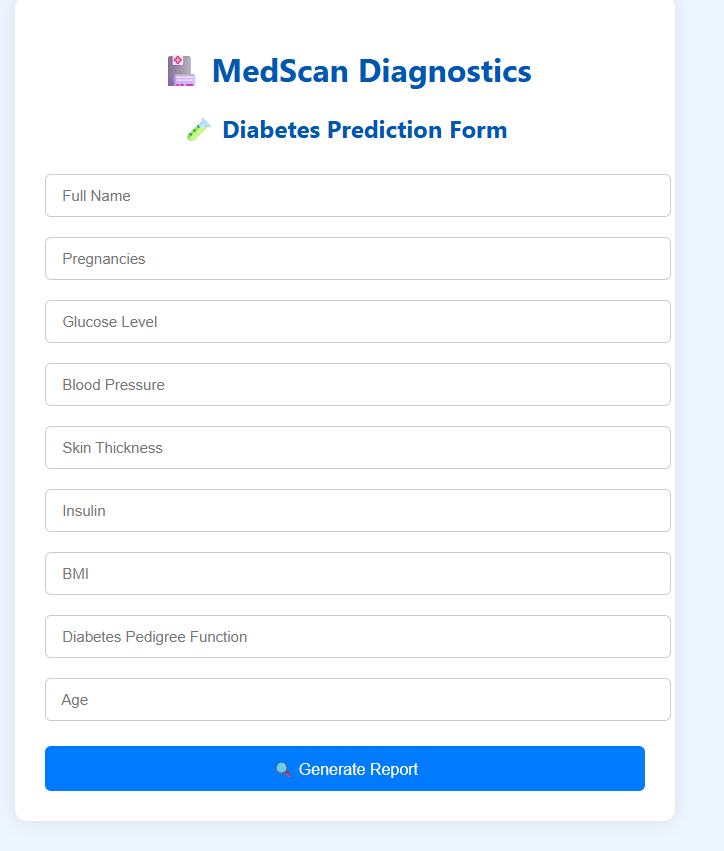
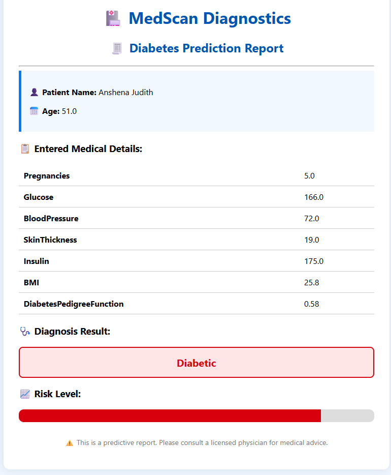
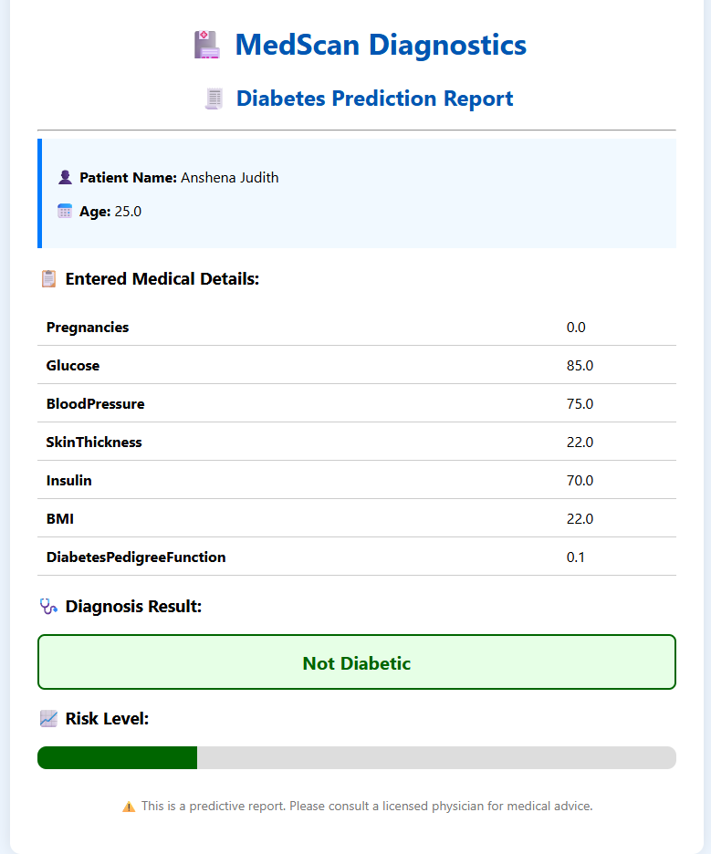

# 🧪 Diabetes Prediction Web App

This is a Machine Learning web application that predicts whether a patient is diabetic or not based on medical input features. Built using Flask, HTML/CSS, and a Random Forest classifier.

## 🚀 Features
- Clean hospital-style UI
- Probabilistic prediction with patient summary
- Built with Scikit-learn and Flask

## 🖥️ Tech Stack
- Python, Flask
- Random Forest Model
- HTML, CSS
- Trained on PIMA Indians Diabetes Dataset

## 📸 Screenshots

### 🔹 Patient Input Form

### 🔹 Prediction Result Page

